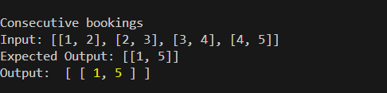
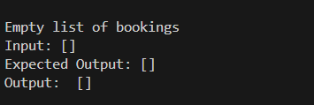
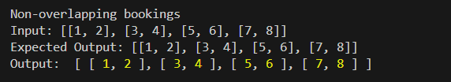
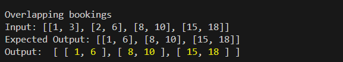

# Question 1

### Function: `optimizeBookings(bookings: number[][])`
This function takes a list of bookings as input and returns a list of optimized bookings with overlapping bookings merged into a single booking.

### Example test case:

### 1. Consecutive Bookings


### 2. Empty Bookings


### 3. Non-Overlapping Bookings


### 4. Overlapping Bookings


## How to Run
1. Clone this repository.
2. Navigate to the Question-1 directory.
3. Run the following command in the terminal:
    ```
    npm install
    npm start
    ```
4. View the output in the terminal.
