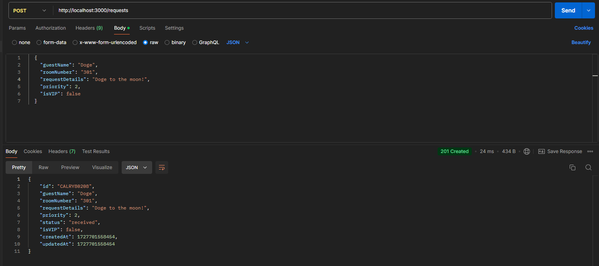
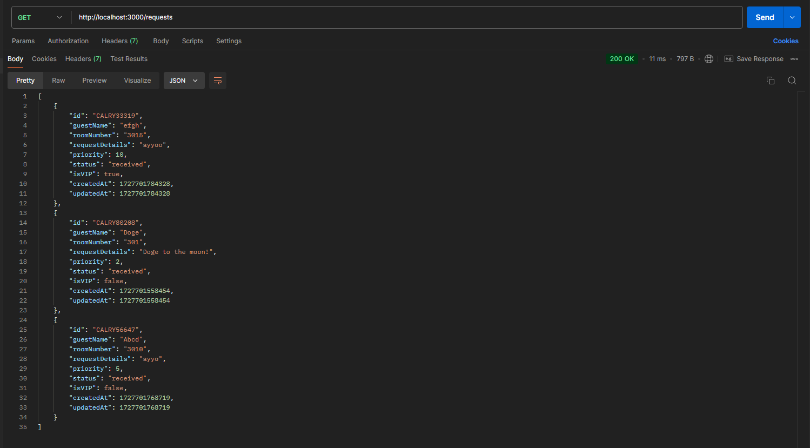
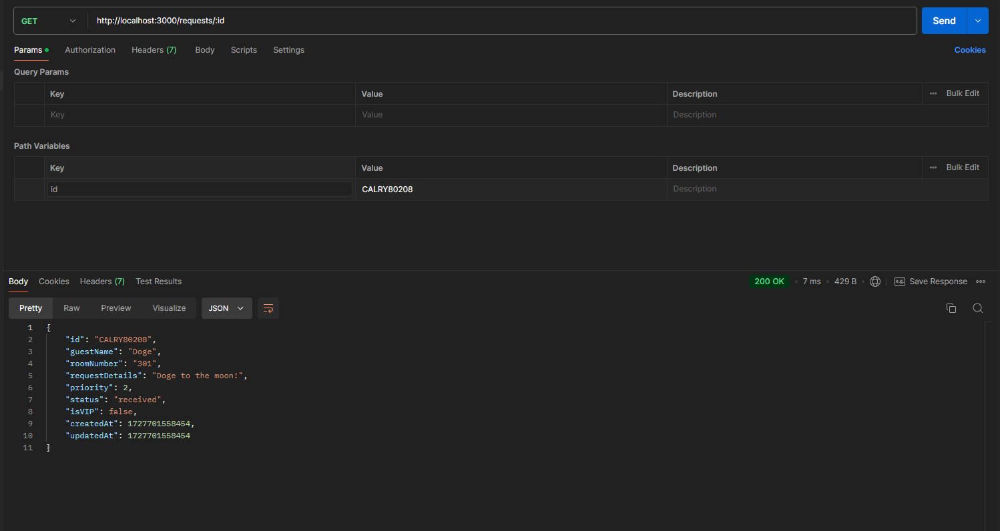
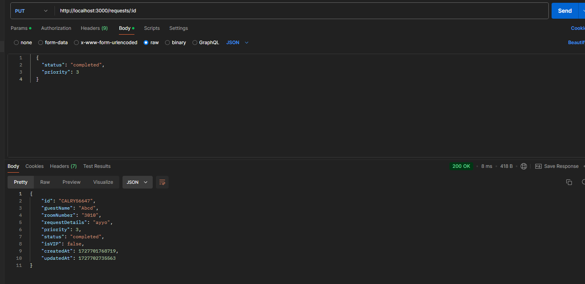
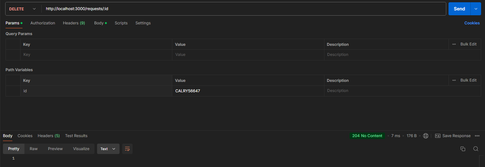
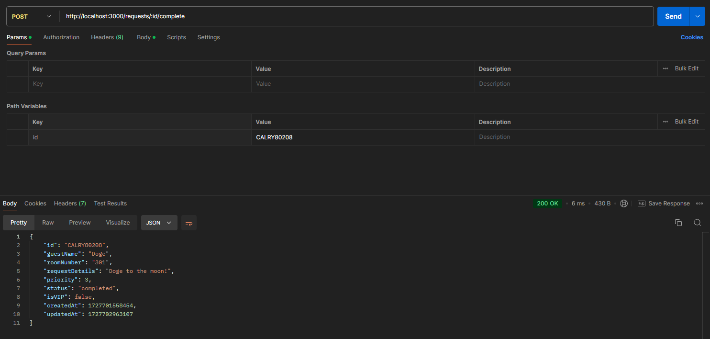

# Question 2

## API Endpoints

### 1. Create a New Service Request

- **Endpoint:** POST `/requests`
- **Description:** Creates a new service request
- **Required Fields:**
  - `guestName` (string): Name of the guest making the request
  - `roomNumber` (number): Room number of the guest
  - `requestDetails` (string): Details of the request
  - `priority` (number): Priority of the request (1, 2, or 3)
  - `isVIP` (boolean): Indicates if the guest is a VIP
- **Sample Payload:**
  ```json
  {
    "guestName": "Doge",
    "roomNumber": 301,
    "requestDetails": "Doge to the moon!",
    "priority": 2,
    "isVIP": false
  }
  ```
- **Response:** Returns the created request object with a generated ID




### 2. Get All Service Requests

- **Endpoint:** GET `/requests`
- **Description:** Retrieves all service requests, sorted by priority
- **Response:** Returns an array of all service request objects sorted by priority(first by completion status, then by vip status, and finally by priority)



### 3. Get a Specific Service Request

- **Endpoint:** GET `/requests/:id`
- **Params:**
  - `id` (string): ID of the service request
- **Description:** Retrieves a specific service request by ID
- **Response:** Returns the requested service request object



### 4. Update a Service Request

- **Endpoint:** PUT `/requests/:id`
- **Params:**
  - `id` (string): ID of the service request
- **Required Fields:**
    - `status` (string): Status of the service request ("in-progress", "completed", "canceled")
    - `priority` (number): Priority of the request (1, 2, or 3) lower number means higher priority
- **Description:** Updates an existing service request
- **Sample Payload:**
  ```json
  {
    "status": "in-progress",
    "priority": 3
  }
  ```
- **Response:** Returns the updated service request object



### 5. Delete a Service Request

- **Endpoint:** DELETE `/requests/:id`
- **Params:**
  - `id` (string): ID of the service request
- **Description:** Deletes a completed or canceled service request
- **Response:** Returns a 204 status code on successful deletion



### 6. Complete a Service Request

- **Endpoint:** POST `/requests/:id/complete`
- **Params:**
  - `id` (string): ID of the service request
- **Description:** Marks a service request as completed
- **Response:** Returns the updated service request object with status set to "completed"




## Testing the Lock Method

To ensure the reliability of the file locking mechanism, I've included a test file testLock.ts in the src/test/ directory. This test file demonstrates the concurrent access handling capabilities of the locking system.

### Test File: `testLock.ts`

The test file implements a simple write operation that acquires a lock, writes to the file, waits for a short period, and then releases the lock. Here's an overview of what this does:

1. It uses the `withFileLock` function from the main `locking.ts` file.
2. It attempts to acquire a lock on a test file.
3. Once the lock is acquired, it reads the current content of the file.
4. It then appends a new line to the file with the current process ID.
5. After writing, it waits for specified(in setTimeout) seconds before releasing the lock.
6. Finally, it logs when the lock is released.

### Running the Test

To test the file locking mechanism:

1. Open multiple terminal windows (at least 2-4).

2. In each terminal, navigate to the Question-2 directory.

3. Run the following command in each terminal:
   ```
   npm run test-lock
   ```

4. Observe the output in each terminal. You should see messages indicating when each process acquires the lock, completes its operation, and releases the lock.

5. After running the test multiple times, you can check the contents of the `test.txt` file in the `dist/test/` directory to see the lines written by each process.

### Expected Behavior

- You should see that only one process can acquire the lock at a time.
- The processes will write to the file in sequence, not simultaneously.
- Each process will hold the lock for specified seconds before releasing it.
- The `dist/test/test.txt` file should contain lines from different processes, demonstrating that they all got a chance to write to the file without conflicts.

[Video test](./screenshots/testlock.mp4)


## How to Run
1. Clone this repository.
2. Navigate to the Question-2 directory.
3. Run the following command in the terminal:
    ```
    npm install
    npm start
    ```
4. The server will start running on `http://localhost:3000` (or the port specified in the `PORT` environment variable).